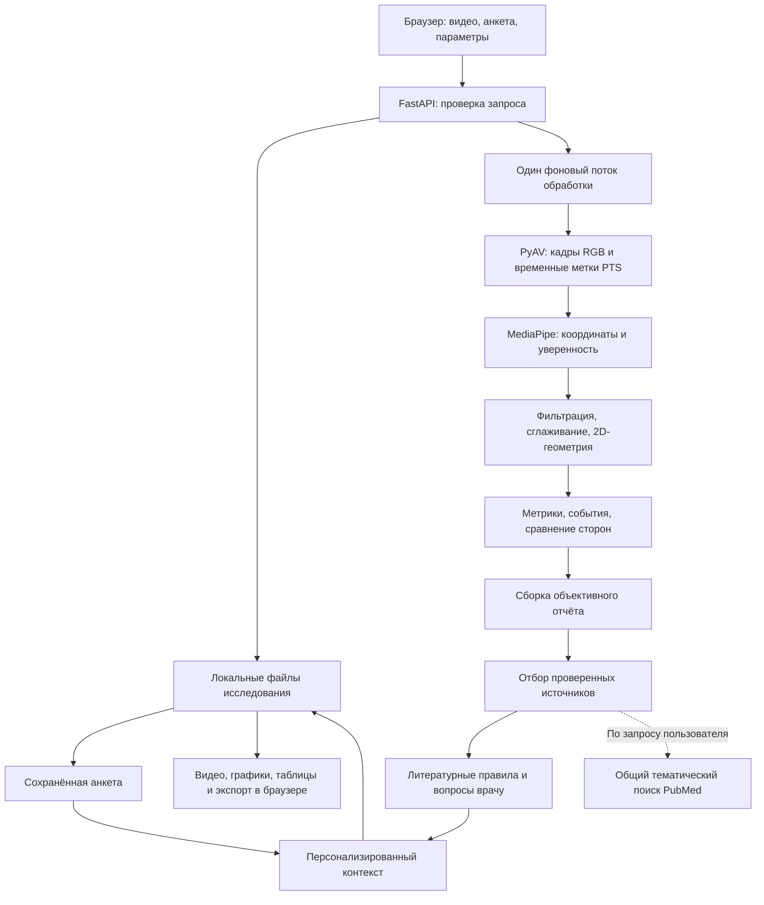

# Кинема: подробное описание программы, систем и метрик

**Состояние реализации: 4 октября 2026 года.** Документ составлен по исходному коду проекта на базе коммита `5b2bb3b`. Он описывает фактически реализованное поведение, включая особенности расчётов и ограничения. Внешние медицинские публикации при подготовке этого документа повторно не проверялись: раздел о литературе описывает правила программы и её локальный каталог, а не новые рекомендации по лечению.

Кинема, или Upper Limb Motion Lab, — локальный однопользовательский исследовательский прототип для измерения движения верхних конечностей и туловища по видео. В одном исследовании сохраняются запись, анкета пациента, координаты суставов, временные графики, численные показатели и литературный контекст.

**Клиническая валидность программы и модели для пациентов не установлена.** Программа не подтверждает диагноз, не выбирает индивидуально безопасное лечение и не назначает препараты, дозы, частоту процедур или нагрузку. Её результаты предназначены для проверки и обсуждения специалистом.

## Содержание

1. [Назначение и пользовательский сценарий](#1-назначение-и-пользовательский-сценарий)
2. [Архитектура и ответственность систем](#2-архитектура-и-ответственность-систем)
3. [Приём и обработка видео](#3-приём-и-обработка-видео)
4. [Распознавание позы](#4-распознавание-позы)
5. [Координаты, фильтрация и нормализация](#5-координаты-фильтрация-и-нормализация)
6. [Условия выдачи метрик и техническая надёжность](#6-условия-выдачи-метрик-и-техническая-надёжность)
7. [Все метрики верхних конечностей](#7-все-метрики-верхних-конечностей)
8. [Метрики туловища, линии плеч и головы](#8-метрики-туловища-линии-плеч-и-головы)
9. [События движения и сравнение сторон](#9-события-движения-и-сравнение-сторон)
10. [Временные ряды и интерфейс просмотра](#10-временные-ряды-и-интерфейс-просмотра)
11. [Анкета пациента и проверка данных](#11-анкета-пациента-и-проверка-данных)
12. [Персонализированный разбор](#12-персонализированный-разбор)
13. [Литература, каталог и PubMed](#13-литература-каталог-и-pubmed)
14. [Отчёт, файлы и происхождение результатов](#14-отчёт-файлы-и-происхождение-результатов)
15. [API, состояния и обработка ошибок](#15-api-состояния-и-обработка-ошибок)
16. [Локальность, защита данных и эксплуатация](#16-локальность-защита-данных-и-эксплуатация)
17. [Демонстрационный пациент](#17-демонстрационный-пациент)
18. [Проверки и границы доказательств](#18-проверки-и-границы-доказательств)
19. [Расширение проекта и ограничения текущей версии](#19-расширение-проекта-и-ограничения-текущей-версии)
20. [Словарь терминов и карта исходников](#20-словарь-терминов-и-карта-исходников)

## 1. Назначение и пользовательский сценарий

### 1.1. Что получает пользователь

- Просмотр исходного движения в совместимой MP4-копии, с наложением скелета и траекторий запястий.
- Синхронные графики проекционных углов, положения и скорости запястий, изменения наклона туловища.
- Максимумы, минимумы, ROM, скорости, длины траекторий и другие описательные показатели.
- Сравнение левой и правой стороны для выбранных показателей.
- Отдельные разделы непосредственно измеренных данных, алгоритмических наблюдений, истории болезни и медицинской литературы.
- Список недостающих сведений, приоритетов очной проверки и методов для обсуждения.
- Экспорт JSON и возможность полностью удалить исследование.

### 1.2. Последовательность работы

1. Подготовить запись одного человека с неподвижной камерой. Плечи, таз и запястья должны оставаться в кадре.
2. Загрузить MP4, MOV или WebM, указать анатомическую поражённую сторону и, при необходимости, задание.
3. Заполнить известные сведения анамнеза и очного обследования. Неизвестные значения оставить неизвестными.
4. Дождаться локальной обработки.
5. Проверить соответствие скелета человеку, покрытие кадров и пропуски.
6. Сопоставить графики и события с конкретными кадрами.
7. Рассмотреть показатели вместе с историей и целями пациента. Проверить источники и условия применимости методов очно.
8. При необходимости дополнить анкету и сохранить её: видеометрики повторно не рассчитываются.

Выбор задания является сообщённым контекстом. Он не запускает отдельную валидированную модель распознавания упражнения и не меняет базовые формулы. Поражённая сторона также задаётся пользователем; программа не устанавливает её самостоятельно.

### 1.3. Поддерживаемые задания

| Код | Название в интерфейсе |
|---|---|
| `unspecified` | Не указано |
| `forward_raise` | Поднять руки вперёд |
| `side_raise` | Поднять руки в стороны |
| `overhead` | Поднять руку над головой |
| `elbow` | Сгибание / разгибание локтя |
| `reach` | Дотянуться до предмета |
| `hand_to_mouth` | Рука ко рту |
| `opposite_shoulder` | Рука к противоположному плечу |
| `free` | Произвольное движение |

## 2. Архитектура и ответственность систем

### 2.1. Общая схема



### 2.2. Состав систем

| Система | Основная ответственность | Реализация |
|---|---|---|
| Web-интерфейс | Загрузка, выбор исследования, просмотр, редактирование анкеты, экспорт | React, TypeScript, Vite |
| API | Проверки входа, маршруты, запуск задач, защита от конфликтующих операций | FastAPI, Pydantic |
| Фоновая обработка | Последовательный анализ одной записи | `ThreadPoolExecutor(max_workers=1)` |
| Видео | Декодирование PTS и создание браузерной копии | PyAV |
| Pose-система | Обнаружение тела и получение девяти используемых точек | MediaPipe Pose Landmarker Lite |
| Биомеханическая математика | Углы, нормализация, сглаживание, производные, ROM, индекс различия | NumPy, отдельные детерминированные функции |
| Анализ движения | Показатели каждой руки, туловища, события и качество | `movement_analysis/analyze.py` |
| Система отчёта | Наблюдения, ограничения, очистка нечисловых результатов | `report/build.py` |
| Анкета и персонализация | Схема полей, валидация, приоритеты и проверяемые условия | `patient.py` |
| Evidence Service | Отбор литературы по темам измерений | Локальный JSON-каталог и Pydantic |
| PubMed | Отдельный поиск библиографических записей | HTTPX, фиксированные NCBI endpoints |
| Система литературных правил | Связи измерений, источников и направлений обсуждения | `recommendations/service.py` |
| Хранилище | JSON, видео, идентификаторы, атомарная запись отдельного файла | Файловая система, `RLock` |
| Демонстрация | Вымышленная анкета, синтетические координаты и схематическая анимация | `scripts/create_demo.py` |

LLM в расчётах и подборе правил не используется. Слова «персонализированный» и «контекст» обозначают программные правила и связь сохранённых данных, а не генерацию индивидуального лечения языковой моделью.

Версии различаются по назначению: приложение/API и алгоритм имеют версию `0.1.0`, итоговая схема отчёта — `1.1`, правило персонализации — `1.0`. Версия каталога источников хранится отдельно. Эти значения не являются результатом клинической сертификации.

## 3. Приём и обработка видео

### 3.1. Ограничения входа

| Проверка | Фактическое условие |
|---|---|
| Расширение | `.mp4`, `.mov`, `.webm`, без учёта регистра |
| Размер файла | Не больше `300 × 1024 × 1024` байт, то есть 300 МиБ; UI пишет «300 МБ» |
| Размер multipart-запроса | `Content-Length` обязателен; предварительный предел — размер файла плюс 2 МиБ |
| Длительность | Не больше 180 с по известной длительности контейнера и по декодированным меткам |
| Количество кадров | Не больше 12 000 |
| Размер кадра | Каждая сторона не меньше 64 px; площадь не больше `3840 × 2160` px |
| Ориентация | Поворот из metadata `rotate` и доступный поворот декодированного кадра отклоняются |
| Время | PTS и `time_base` должны существовать; метки должны строго возрастать |
| Минимум для анализа | Не меньше пяти декодированных кадров |

Ограничение разрешения реализовано через минимум ширины/высоты и максимум площади, а не через отдельные максимумы 3840 и 2160. Например, нестандартное соотношение сторон может пройти проверку площади. Определение display-matrix rotation зависит от того, что предоставляет декодер; программа не обещает распознать все способы хранения поворота.

Контейнер и кодек должны реально декодироваться. Допустимое расширение само по себе не гарантирует пригодности файла. Первичная проверка читает первый видеопоток; звук для измерений не используется. Освещение и движение камеры автоматически не оцениваются: в `video_quality` они обозначены как `not assessed`.

### 3.2. Временные метки

Для каждого кадра:

```text
t_i = PTS_i × time_base_i − время первого декодированного кадра
```

Таким образом, отсчёт начинается с нуля. Скорости считаются по реальным `t_i`, включая видео с переменной частотой кадров. Система не заменяет время формулой `номер кадра / FPS`.

MediaPipe требует возрастающих целых миллисекунд. Для него передаётся `max(round(t_i × 1000), предыдущая_ms + 1)`. В сохранённых кадрах и математике остаётся исходное время в секундах, а не искусственно увеличенная метка MediaPipe.

### 3.3. Браузерная MP4-копия

`PreviewWriter` кодирует RGB-кадры в H.264 (`libx264`), `yuv420p`, без звука. Настройки: `crf=23`, `preset=veryfast`, временная база `1/1 000 000`. PTS записываются с микросекундным разрешением. Номинальный FPS используется как настройка потока; при его отсутствии берётся 30.

Нечётные размеры уменьшаются до ближайших чётных. Это нужно для кодирования и может дать отличие на один пиксель от исходного кадра. Исходный файл хранится отдельно. Скелет не вшивается в MP4: его рисует браузер на canvas.

### 3.4. Ход задачи

После приёма создаётся `queued`, затем worker записывает `processing`. Примерно раз в 0,5 с сохраняются количество обработанных кадров и прогресс. При известной длительности прогресс равен отношению времени кадра к длительности, ограниченному 0,95 до окончания работы. При неизвестной длительности он может быть `null`.

После сохранения результатов — `completed`, `progress=1`. При ошибке — `failed`. `decoded_duration_seconds` в отчёте соответствует времени последнего декодированного кадра; это не обязательно длительность контейнера с учётом продолжительности последнего кадра.

## 4. Распознавание позы

### 4.1. Модель и используемые точки

Используется локальный файл `models/pose_landmarker_lite.task`, модель MediaPipe Pose Landmarker Lite. Режим — `VIDEO`, запрашивается до двух поз. Минимальные пороги обнаружения, присутствия позы и трекинга модели — по `0.5`.

Из результата сохраняются девять канонических точек:

| Имя | Индекс MediaPipe | Смысл |
|---|---:|---|
| `nose` | 0 | Нос, прокси положения головы |
| `left_shoulder` | 11 | Левое плечо |
| `right_shoulder` | 12 | Правое плечо |
| `left_elbow` | 13 | Левый локоть |
| `right_elbow` | 14 | Правый локоть |
| `left_wrist` | 15 | Левое запястье, прокси положения кисти |
| `right_wrist` | 16 | Правое запястье |
| `left_hip` | 23 | Левая точка таза |
| `right_hip` | 24 | Правая точка таза |

Левые и правые точки — анатомические стороны человека. Отзеркалённую запись следует исправить заранее. Постоянная идентификация пациента между кадрами не реализована.

### 4.2. Данные точки

Сохраняются `x`, `y`, `z`, `visibility`, `presence`, `confidence` и `timestamp`. Уверенность для дальнейшей обработки:

```text
confidence = min(visibility, presence)
```

`x` и `y` нормированы относительно изображения. `z` является модельной относительной глубиной и не используется в текущих клинических или 2D-метриках. Наличие `z` в JSON не означает наличие калиброванной 3D-биомеханики.

### 4.3. Ноль или несколько людей

Если обнаружено не ровно одно тело, provider возвращает пустой набор landmarks и количество обнаруженных поз. Поэтому кадр не используется для расчётов положения пациента. При двух обнаруженных позах приложение не выбирает произвольно «основного» человека. Число `people` — результат модели с настроенным пределом, а не достоверная перепись всех людей в кадре.

## 5. Координаты, фильтрация и нормализация

### 5.1. Допуск точки

Точка допускается к расчётам, если она существует, `confidence >= 0.6`, а `x` и `y` находятся в `[0,1]`. Остальные координаты становятся `NaN` внутри вычислений. Перед сериализацией нечисловые значения заменяются на JSON `null`.

Пропущенные точки не заменяются нулями и не восстанавливаются интерполяцией. Порог `0.6` для точки отличается от модельных порогов `0.5` из предыдущего раздела.

### 5.2. Коррекция геометрии изображения

Координаты переводятся в пиксели до геометрических вычислений:

```text
P = (x × ширина_кадра, y × высота_кадра)
```

Это учитывает различие масштаба осей в прямоугольном кадре. Вычисление угла прямо в нормированных координатах без этой коррекции искажало бы его при разных соотношениях сторон.

Далее `S`, `E`, `W`, `H` обозначают сглаженные пиксельные координаты плеча, локтя, запястья и таза соответствующей стороны. `C_S` и `C_H` — текущие середины двух плеч и двух точек таза.

### 5.3. Сглаживание

Для каждой точки применяется среднее внутри временного окна 0,15 с: от `t_i − 0.075` до `t_i + 0.075`. Усреднение выполняется только внутри непрерывного участка пригодных значений. Участок разрывается при пропуске или временном промежутке больше 0,25 с. На краях окна берутся доступные значения.

Это среднее по кадрам внутри окна, а не интеграл по времени. В видео с переменным FPS плотные по кадрам участки имеют больший вес. Сглаживание может уменьшить выраженность пиков; экстремумы относятся к обработанным данным.

### 5.4. Фиксированный масштаб

```text
ширина_плеч_i = ||S_left,i − S_right,i||
d = median(пригодные ширины_плеч_i)
```

Ширина вычисляется по сглаженным точкам. Значения меньше 5 px исключаются. Для определения `d` нужно не меньше 60% кадров с пригодной шириной. Сам масштаб фиксирован на весь ролик; он не заменяется текущей шириной плеч в каждом кадре.

Общая нормализация:

```text
Q(P, O) = (P − O) / d
```

При неизвестном или практически нулевом `d` нормализованные значения отсутствуют. При этом проекционные углы могут оставаться измеримыми: они не требуют масштаба в ширинах плеч.

**ШП** означает одну медианную видимую ширину плеч на этой записи. Это не метр, не сантиметр и не анатомически фиксированный размер. Ракурс, поворот тела и перспектива меняют видимую ширину. Нормализация не гарантирует сопоставимости разных сеансов.

### 5.5. Производные

Производные вычисляются `numpy.gradient(values, times)` по фактическим временным меткам, внутри участков минимум из трёх значений. На краях используются односторонние, внутри — соответствующие численной реализации разности с учётом неравномерного шага времени. Пропуски и разрывы больше 0,25 с не соединяются производной.

Для положения запястья используется текущий центр плеч как начало координат. Поэтому скорость отражает движение запястья относительно движущегося центра плеч, а не абсолютную скорость в пространстве или на изображении.

## 6. Условия выдачи метрик и техническая надёжность

### 6.1. Формат отдельной метрики

```json
{
  "value": 20.0,
  "unit": "deg",
  "coverage": 0.85,
  "valid_frames": 170,
  "technical_reliability": "medium",
  "status": "measured"
}
```

Это иллюстрация структуры, не данные человека. `coverage` — число конечных значений данной вычисляемой серии, делённое на число всех кадров; записывается с округлением до четырёх знаков. `valid_frames` — число пригодных значений, а не число кадров с человеком вообще.

Метрика выдаётся, если одновременно есть минимум пять конечных значений, покрытие не меньше 0,6, а результат операции конечен. Порог проверяется до округления `coverage`.

| Состояние | Условие | Результат |
|---|---|---|
| `high` | Метрика вычислима, покрытие не меньше 0,9 | Значение, статус `measured` |
| `medium` | Метрика вычислима, покрытие от 0,6 до менее 0,9 | Значение, статус `measured` |
| `low` | Недостаток данных или нечисловой итог | `value=null`, русская строка о невозможности надёжного определения |

Надёжность описывает техническую достаточность данных. Это не вероятность правильного диагноза, не погрешность в градусах, не доверительный интервал и не клинически установленная точность.

### 6.2. Качество landmarks и общий уровень

Для каждой точки `pose_quality.landmarks` содержит долю исходных пригодных координат и средний `confidence`. Средний confidence учитывает все кадры: для отсутствующей точки подставляется 0. Уверенность существующей точки может входить в среднее даже тогда, когда её координаты вне кадра и сама точка исключена из геометрии.

Общий `pose_quality.level` определяется средним покрытием девяти точек: от 0,9 — `high`, от 0,6 — `medium`, ниже — `low`. Это отдельный показатель: высокое среднее покрытие не делает каждую конкретную метрику измеримой. Есть также счётчики `no_person_frames` и `ambiguous_person_frames`.

### 6.3. Единицы

| Код | Отображение | Смысл |
|---|---|---|
| `deg` | ° | Проекционный угол или его диапазон |
| `deg/s` | °/с | Модуль численной угловой скорости |
| `s` | с | Время от начала записи или длительность |
| `shoulder_width` | ШП | Расстояние в фиксированных видимых ширинах плеч |
| `shoulder_width/s` | ШП/с | Нормализованная скорость |
| `ratio` | Без единицы | Отношение, в частности CV |

## 7. Все метрики верхних конечностей

Каждая метрика рассчитывается отдельно для `left_arm` и `right_arm`. Есть 15 базовых ключей для каждой стороны и условный 16-й `reach_duration`; вместе с тремя метриками туловища возможно до 35 объектов метрик. Присутствие объекта не гарантирует наличие численного значения.

### 7.1. Базовая формула угла

Для трёх точек `A, B, C`, с вершиной в `B`:

```text
u = A − B
v = C − B
angle(A, B, C) = arccos(clip((u · v) / (||u|| × ||v||), −1, 1)) × 180 / π
```

При непригодных координатах или произведении длин меньше `1e−9` угол отсутствует. Результат — неориентированный угол от 0° до 180°.

### 7.2. Плечо

Проекционный угол плеча `θ_S(t) = angle(H, S, E)`. Вершина — плечо; сравниваются направления от плеча к тазу и к локтю. Рука вдоль направления к тазу имеет около 0°. Это не отдельная оценка сгибания, отведения или вращения в плечевом суставе.

| Ключ | Формула | Единица | Значение |
|---|---|---|---|
| `shoulder_max` | `max(θ_S)` | ° | Максимальный наблюдаемый проекционный подъём |
| `shoulder_rom` | `max(θ_S) − min(θ_S)` | ° | Диапазон угла за весь ролик |
| `shoulder_peak_angular_speed` | `max(abs(dθ_S/dt))` | °/с | Наибольшая скорость изменения угла без знака направления |

ROM характеризует диапазон в данном задании и записи. Если пациент не выполнял полное движение или пик был пропущен, это не измерение его максимально доступной клинической амплитуды. Угол зависит от проекции тела и направления линии плечо–таз.

### 7.3. Локоть

Проекционный угол локтя `θ_E(t) = angle(S, E, W)`. Прямые проекции плеча и предплечья дают примерно 180°, а при сгибании геометрический угол уменьшается. Это отличается от клинической записи «дефицит разгибания 20°» или «сгибание 90°»; отдельное преобразование в клиническую систему не выполняется.

| Ключ | Формула | Единица | Значение |
|---|---|---|---|
| `elbow_min` | `min(θ_E)` | ° | Минимальный геометрический угол на записи |
| `elbow_max` | `max(θ_E)` | ° | Максимальный угол |
| `elbow_rom` | `max(θ_E) − min(θ_E)` | ° | Диапазон изменения |
| `elbow_peak_angular_speed` | `max(abs(dθ_E/dt))` | °/с | Пиковая скорость изменения без знака |

Например, изменение от 135° до 155° даёт ROM 20°. Это арифметический пример; само число не устанавливает причину ограничения или тяжесть заболевания.

### 7.4. Положение и скорость запястья

```text
q_W(t) = (W(t) − C_S(t)) / d
v_W(t) = ||dq_W/dt||
```

| Ключ | Формула | Единица | Значение |
|---|---|---|---|
| `wrist_mean_speed` | Среднее всех конечных `v_W` | ШП/с | Средняя нормализованная скорость |
| `wrist_peak_speed` | `max(v_W)` | ШП/с | Пиковая нормализованная скорость |
| `wrist_max_height` | `max(−(W_y − S_y)/d)` | ШП | Наибольшая высота запястья относительно плеча этой стороны |
| `wrist_path_length` | Сумма `norm(q_W,i − q_W,i−1)` внутри непрерывных участков | ШП | Длина видимой относительной траектории |

Высота положительна выше плеча и отрицательна ниже него. Даже максимальная высота может быть отрицательной, если запястье всё время находилось ниже плеча.

Средняя скорость является средним **по кадрам**, а не по длительности участков. Для VFR-видео она не тождественна общей длине траектории, делённой на время. Пиковая скорость чувствительна к шуму распознавания и временным интервалам.

Длина траектории не соединяет пропуски и разрывы больше 0,25 с. Она не включает неизвестное движение между участками и может занижать путь. Её покрытие и допуск берутся по нормализованному положению запястья, а не по числу пригодных скоростей. В крайнем случае сумма может быть 0 при разрозненных одиночных пригодных точках без измеримого пути между ними; это не доказательство неподвижности.

Слово «кисть» в UI означает здесь положение точки запястья. Движения пальцев, захват, отпускание предмета и вращение кисти не извлекаются.

### 7.5. Подъём плечевого пояса

Ключ `shoulder_girdle_rise`, единица ШП:

```text
e(t) = (S_y(t) − C_H,y(t)) / d
e_0 = median(e в первых 0,5 с)
rise(t) = −(e(t) − e_0)
shoulder_girdle_rise = max(rise)
```

Базовый уровень требует минимум трёх конечных значений в первых 0,5 с. При его отсутствии серия подъёма не определяется. Положительное значение означает смещение точки плеча вверх относительно центра таза по сравнению с началом.

Это прокси смещения плеча, а не отдельное измерение движения лопатки или плечелопаточного ритма. Перемещение таза и тела также влияет на показатель.

### 7.6. Вариабельность скорости

Ключ `speed_variability_cv`, единица `ratio`:

```text
CV = std(v_W) / mean(v_W), если mean(v_W) > 0.01 ШП/с
```

Используется стандартное отклонение NumPy с `ddof=0`, то есть по всей совокупности доступных значений. Если средняя скорость не превышает 0,01, CV отсутствует, даже при хорошем покрытии.

CV — описательная вариабельность скорости за весь ролик, включая разные фазы движения. Например, `0.5` означает отношение стандартного отклонения к среднему 0,5; UI не умножает его на 100. Это не валидированная оценка плавности, координации, спастичности или количества остановок.

### 7.7. Время максимального подъёма

Ключ `time_to_max`, единица с. Находится индекс глобального максимума пригодной серии `θ_S`, затем возвращается его временная метка от начала записи. При одинаковых максимумах NumPy выбирает первый.

Значение выдаётся только при измеримом `shoulder_max`; покрытие и техническая надёжность наследуются от него. Это время максимума **от начала видео**, а не время от начала движения и не клиническое время реакции.

### 7.8. Локоть в момент максимума плеча

Ключ `elbow_at_shoulder_max`, единица °. Возвращается `θ_E` в кадре глобального максимума плеча. Нужны пригодный максимум плеча, измеримый `elbow_max` и конечный угол локтя в выбранном кадре.

Качество и счётчик пригодных кадров наследуются от серии локтя. Они не являются отдельной оценкой точности единственного выбранного кадра. При отсутствии необходимых условий `value=null`, надёжность `low`.

### 7.9. Длительность подъёма

Ключ `reach_duration`, единица с:

```text
reach_duration = время глобального максимума плеча − время кандидата начала подъёма
```

Ключ добавляется только при выполнении эвристики начала, описанной в разделе 9. Он не обязан присутствовать в объекте руки. Качество наследуется от `time_to_max`, отдельная проверка непрерывности всей фазы не выполняется. Это оценка доминирующего подъёма, а не валидированная длительность любого reach-задания или полного цикла «подъём и возвращение».

## 8. Метрики туловища, линии плеч и головы

Все три ключа находятся в `metrics.trunk`:

| Ключ | Показатель | Единица |
|---|---|---|
| `max_lateral_tilt_change` | Максимальное абсолютное изменение бокового наклона относительно начала | ° |
| `shoulder_line_rom` | Диапазон наклона линии плеч | ° |
| `head_lateral_range` | Боковой диапазон положения носа относительно центра плеч | ШП |

### 8.1. Изменение бокового наклона туловища

Вектор `T(t) = C_S(t) − C_H(t)`. Если его длина меньше 5 px, наклон отсутствует.

```text
α(t) = atan2(T_x, −T_y) × 180 / π
α_0 = median(α в первых 0,5 с), минимум три конечных значения
Δα(t) = α(t) − α_0
max_lateral_tilt_change = max(abs(Δα))
```

Ключ находится в `metrics.trunk`, единица °. Положительный знак сырого наклона соответствует смещению центра плеч вправо на изображении относительно таза; в итоговой метрике знак убран. Это изменение относительно начала, а не абсолютный наклон от вертикали и не анатомическое направление пациента.

Развёртка углов при переходе через границу `atan2` не выполняется. Поворот тела, перспектива, движения вне плоскости и движение камеры могут искажать результат. Показатель не доказывает патологическую компенсацию.

### 8.2. Диапазон наклона линии плеч

```text
β = atan2(S_left,y − S_right,y, S_left,x − S_right,x) × 180 / π
β = (β + 90) mod 180 − 90
shoulder_line_rom = max(β) − min(β)
```

Ключ `trunk.shoulder_line_rom`, единица °. Приведение к диапазону `[-90°, 90°)` уменьшает скачок, связанный с направлением горизонтальной линии. На границе этого диапазона всё ещё возможен скачок; специальной развёртки нет. Это диапазон наклона линии двух плеч, а не ROM позвоночника или движения лопатки.

### 8.3. Боковой диапазон положения носа

```text
q_N(t) = (nose(t) − C_S(t)) / d
head_lateral_range = max(q_N,x) − min(q_N,x)
```

Ключ `trunk.head_lateral_range`, единица ШП. Это боковое смещение точки носа относительно центра плеч. Ориентация головы, движения шеи, взгляд и угол поворота головы не определяются.

## 9. События движения и сравнение сторон

### 9.1. Максимум

Для каждой стороны с измеримым `shoulder_max` создаётся событие `maximum`. Его время совпадает с `time_to_max`. На каждую сторону выделяется один глобальный максимум за запись; повторные циклы отдельно не сегментируются.

### 9.2. Кандидаты начала и возвращения

Начальный уровень плечевого угла `B` — медиана первых 0,5 с, минимум три значения. Дополнительные события рассматриваются только при `θ_peak − B >= 15°`.

1. `onset_candidate`: первый кадр **до** глобального максимума, в котором `θ_S > B + 10°`.
2. `return_candidate`: первый кадр **после** максимума, в котором `θ_S <= B + 10°`; ищется только при найденном начале.

События сортируются по времени. Начало может быть найдено, а возвращение — отсутствовать. Строгое неравенство для начала отличается от нестрогого для возвращения.

Эвристика не требует непрерывного пересечения порога, не проверяет отсутствие промежуточных пропусков и не распознаёт структуру произвольного задания. Она описывает кандидатов фаз одного доминирующего подъёма, а не подтверждённые фазы реабилитационного упражнения.

### 9.3. Асимметрия

Для шести показателей — `shoulder_rom`, `elbow_rom`, `wrist_mean_speed`, `wrist_peak_speed`, `wrist_path_length`, `time_to_max` — сохраняются значения слева и справа и симметричный индекс:

```text
A = 200 × abs(L − R) / (abs(L) + abs(R))
```

При пропуске одной стороны, нечисловом значении или знаменателе меньше `1e−9` индекс отсутствует. Для неотрицательных показателей диапазон индекса — от 0 до 200%, а не до 100%. При `L=20`, `R=10` индекс примерно 66,7%; при `L=0`, `R>0` — 200%; при двух нулях — не определён.

Индекс не показывает направление различия — для этого нужны исходные L и R. Когда обе стороны измеримы, техническая надёжность сравнения выставляется `medium`, даже если исходные метрики имеют `high`. Это программное правило, не статистическая оценка.

Сравнение допустимо интерпретировать только с учётом сопоставимости заданий. Индекс не является процентом утраты функции, оценкой тяжести инсульта или автоматическим основанием выбора одно- либо двусторонней терапии.

## 10. Временные ряды и интерфейс просмотра

### 10.1. Содержимое `series`

На каждый кадр сохраняется запись с `timestamp` и следующими рядами:

| Ключ | Начало координат / формула | Единица и знак |
|---|---|---|
| `left_shoulder_angle`, `right_shoulder_angle` | `angle(H,S,E)` | ° |
| `left_elbow_angle`, `right_elbow_angle` | `angle(S,E,W)` | ° |
| `left_wrist_x`, `right_wrist_x` | Горизонтальная компонента `Q(W,C_S)` | ШП, вправо на изображении «+» |
| `left_wrist_y`, `right_wrist_y` | Вертикальная компонента `Q(W,C_S)` | ШП, вниз «+» |
| `left_wrist_speed`, `right_wrist_speed` | Модуль производной нормализованного положения | ШП/с |
| `left_shoulder_rise`, `right_shoulder_rise` | Изменение высоты плеча относительно таза и начала | ШП, вверх «+» |
| `trunk_tilt` | `Δα` | °, изменение со знаком |
| `shoulder_line_tilt` | Приведённый `β` | ° |
| `head_x`, `head_y` | Компоненты `Q(nose,C_S)` | ШП, вправо/вниз «+» |

Итого 17 полей вместе с временем. `wrist_y` и `wrist_max_height` используют разные начала координат и знак: график положения — относительно центра плеч и вниз положительно; максимальная высота — относительно плеча своей стороны и вверх положительно.

### 10.2. Плеер и canvas

Плеер использует `preview.mp4`. Canvas рисует исходные landmarks, прошедшие допуск; графики и метрики основаны на сглаженных координатах. Поэтому визуальная линия исходного скелета и вычисленная серия могут не совпадать идеально.

Для текущего времени видео бинарным поиском выбирается последний кадр с меткой не позже этого времени. Скелет рисуется только при разнице времени не больше 0,15 с, чтобы не показывать давно потерянную позу. Для изображения используется исходный размер кадра. Левая анатомическая сторона отмечается зелёным, правая — оранжевым.

Траектория запястья показывает точки за последние 3 с, но дополнительно ограничена просмотром до 180 предыдущих кадров. На высоком FPS фактическая глубина может быть меньше трёх секунд. При пропуске или разрыве больше 0,25 с линия разрывается.

### 10.3. Синхронизация и графики

Общее состояние `time` связывает видео, ползунок, события и вертикальную линию на графике. При расхождении времени видео и выбранного времени больше 0,12 с плеер выполняет переход. События `timeupdate` и `seeked` обновляют выбранное время.

В UI доступны шесть видов графика: угол плеча, угол локтя, скорость запястья, вертикальное и горизонтальное положение запястья, изменение наклона туловища. Остальные ряды доступны в JSON. `connectNulls=false`: отсутствующие значения не соединяются графиком. Нажатие на график переводит просмотр к выбранному времени.

При обработке статус опрашивается примерно раз в секунду. При завершении отчёт и landmarks загружаются параллельно. Отмена эффекта при смене исследования предотвращает подстановку результатов предыдущего выбора. Повторный выбор уже открытого исследования не очищает отчёт.

## 11. Анкета пациента и проверка данных

### 11.1. Назначение и схема

46 полей распределены по пяти группам: 4 общих, 10 анамнестических, 12 по безопасности, 13 по очной оценке, 7 по целям и условиям реабилитации. Схему и значения по умолчанию выдаёт `GET /api/patient-form`; frontend строит форму по ней. Это уменьшает расхождение правил UI и backend.

ФИО и контакты не требуются; предусмотрен код пациента. Изменение анкеты конкретного исследования не создаёт общую карточку человека для всех его записей.

### 11.2. Все поля

В таблице ниже перечислены ключи, подписи, типы и ограничения из действующей схемы. Трёхзначное поле да/нет имеет значения `unknown`, `yes`, `no`; неизвестность не равна ответу «нет».

<!-- PATIENT_FIELDS_START -->
#### Общие сведения (4 поля)

| Ключ | Подпись | Тип | Допустимые значения / ограничение | Пояснение |
|---|---|---|---|---|
| `patient_code` | Код пациента | Текст | До 300 символов | Используйте код вместо ФИО. Не указывайте паспорт, адрес или контакты. |
| `age` | Возраст, лет | Число | 0–120; null допустим; целое | — |
| `sex` | Пол | Выбор | `unknown` — Не указан; `female` — Женский; `male` — Мужской; `other` — Другой | — |
| `dominant_hand` | Ведущая рука до заболевания | Выбор | `unknown` — Неизвестно; `left` — Левая; `right` — Правая; `both` — Обе | — |

#### История болезни (10 полей)

| Ключ | Подпись | Тип | Допустимые значения / ограничение | Пояснение |
|---|---|---|---|---|
| `condition` | Основная группа заболевания | Выбор | `unknown` — Не определена; `stroke` — Инсульт; `brain_injury` — Черепно-мозговая травма; `orthopedic` — Травма / заболевание суставов и мышц; `other_neurological` — Другое неврологическое заболевание; `other` — Другое | — |
| `diagnosis` | Диагноз и его формулировка из медицинских документов | Текст | До 300 символов | Диагноз не устанавливается по видео. |
| `diagnosis_confirmed` | Диагноз подтверждён врачом | Выбор | `unknown` — Неизвестно / не оценено; `yes` — Да; `no` — Нет | — |
| `onset_date` | Дата заболевания / травмы | Дата | YYYY-MM-DD; не позже текущей даты; null допустим | — |
| `history` | Течение заболевания и изменения функции руки | Многострочный текст | До 3000 символов | — |
| `previous_function` | Функция рук и самостоятельность до заболевания | Многострочный текст | До 3000 символов | — |
| `surgeries` | Операции, переломы, вывихи, повреждения сухожилий и даты | Многострочный текст | До 3000 символов | — |
| `comorbidities` | Сопутствующие заболевания | Многострочный текст | До 3000 символов | Включая сердечно-сосудистые заболевания, диабет, эпилепсию, остеопороз и заболевания суставов, если известны. |
| `medications` | Препараты, дозы, недавние изменения и нежелательные эффекты | Многострочный текст | До 3000 символов | Только сведения для специалиста; приложение не меняет медикаментозное лечение. |
| `allergies` | Аллергии и реакции на лечение | Многострочный текст | До 3000 символов | — |

#### Безопасность и ограничения (12 полей)

| Ключ | Подпись | Тип | Допустимые значения / ограничение | Пояснение |
|---|---|---|---|---|
| `medical_clearance` | Врач оценил возможность реабилитационной нагрузки | Выбор | `unknown` — Неизвестно / не оценено; `yes` — Да; `no` — Нет | — |
| `medical_restrictions` | Ограничения врача и противопоказания | Многострочный текст | До 3000 символов | Запреты движений/нагрузки, послеоперационный режим. Если ограничений нет, укажите это явно. |
| `pain_rest` | Боль в покое, 0–10 | Число | 0–10; null допустим | — |
| `pain_movement` | Боль при движении, 0–10 | Число | 0–10; null допустим | — |
| `pain_details` | Где болит, как давно и что усиливает боль | Многострочный текст | До 3000 символов | — |
| `shoulder_instability` | Подвывих / нестабильность плеча по оценке специалиста | Выбор | `unknown` — Неизвестно / не оценено; `yes` — Да; `no` — Нет | — |
| `recent_injury` | Недавняя травма, незажившая операция или повреждение кожи | Выбор | `unknown` — Неизвестно / не оценено; `yes` — Да; `no` — Нет | — |
| `cardiorespiratory_symptoms` | Боль в груди, выраженная одышка, обмороки при нагрузке | Выбор | `unknown` — Неизвестно / не оценено; `yes` — Да; `no` — Нет | — |
| `new_neurological_symptoms` | Новые или внезапно усилившиеся неврологические симптомы | Выбор | `unknown` — Неизвестно / не оценено; `yes` — Да; `no` — Нет | — |
| `fatigue` | Утомляемость и переносимость занятий | Многострочный текст | До 3000 символов | — |
| `falls` | Падения, головокружение, устойчивость сидя и при перемещениях | Многострочный текст | До 3000 символов | — |
| `implanted_device` | Кардиостимулятор или другое имплантированное электронное устройство | Выбор | `unknown` — Неизвестно / не оценено; `yes` — Да; `no` — Нет | — |

#### Очная оценка верхней конечности (13 полей)

| Ключ | Подпись | Тип | Допустимые значения / ограничение | Пояснение |
|---|---|---|---|---|
| `assessment_source` | Кто предоставил данные о функции руки | Выбор | `unknown` — Не указано; `patient` — Пациент / близкий; `clinician` — Медицинский специалист | — |
| `assessment_date` | Дата очной оценки | Дата | YYYY-MM-DD; не позже текущей даты; null допустим | — |
| `strength` | Сила мышц плеча, локтя, кисти; шкала и результаты | Многострочный текст | До 3000 символов | Например, MRC по мышечным группам; не выводится из углов видео. |
| `spasticity` | Повышенный тонус / спастичность по очной оценке | Выбор | `unknown` — Неизвестно / не оценено; `yes` — Да; `no` — Нет | — |
| `tone_details` | Тонус: мышцы, шкала, значения и дата | Многострочный текст | До 3000 символов | — |
| `passive_rom` | Пассивная амплитуда, контрактуры и болезненные ограничения | Многострочный текст | До 3000 символов | — |
| `sensation` | Чувствительность и ощущение положения конечности | Многострочный текст | До 3000 символов | — |
| `hand_function` | Захват, отпускание, мелкая моторика и применение кисти | Многострочный текст | До 3000 символов | — |
| `wrist_extension` | Активное разгибание запястья при очной оценке, ° | Число | 0–90; null допустим | — |
| `finger_extension` | Активное разгибание пальцев при очной оценке, ° | Число | 0–90; null допустим | — |
| `vision_attention` | Нарушения зрения / внимания / неглект | Выбор | `unknown` — Неизвестно / не оценено; `yes` — Да; `no` — Нет | — |
| `cognition_communication` | Понимание инструкций, память, речь и настроение | Многострочный текст | До 3000 символов | — |
| `functional_scales` | Функциональные шкалы, результаты и даты | Многострочный текст | До 3000 символов | При наличии: Fugl-Meyer UE, ARAT, Barthel. Без самостоятельного вычисления по видео. |

#### Цели и условия реабилитации (7 полей)

| Ключ | Подпись | Тип | Допустимые значения / ограничение | Пояснение |
|---|---|---|---|---|
| `daily_limitations` | Какие повседневные действия затруднены | Многострочный текст | До 3000 символов | Еда, одевание, гигиена, работа с предметами и другие конкретные задачи. |
| `goals` | Приоритетные цели пациента | Многострочный текст | До 3000 символов | Что человек хочет снова делать рукой; срок и критерий успеха обсудите со специалистом. |
| `current_rehabilitation` | Текущая программа, упражнения и специалисты | Многострочный текст | До 3000 символов | — |
| `previous_treatment` | Предыдущее лечение, эффект и нежелательные реакции | Многострочный текст | До 3000 символов | — |
| `support_environment` | Помощь близких, условия дома, оборудование и доступность занятий | Многострочный текст | До 3000 символов | — |
| `video_context` | Условия видео: задание, помощь, боль, усталость, положение тела | Многострочный текст | До 3000 символов | — |
| `information_source` | Источник анамнеза и даты документов | Многострочный текст | До 3000 символов | Пациент, близкий, выписка, заключение специалиста. Свободный текст сохраняется как сообщённая информация, без автоматической медицинской интерпретации. |
<!-- PATIENT_FIELDS_END -->

### 11.3. Backend-валидация

Модель Pydantic создаётся из `FIELDS`. Неизвестные ключи запрещены (`extra='forbid'`). Текст по краям очищается от пробелов. Однострочный текст ограничен 300 символами, многострочный — 3000. Select-поля допускают только перечисленные значения и по умолчанию имеют `unknown`.

Возраст — строгий integer от 0 до 120; другие числа — строгие числовые поля в заданных диапазонах, с запретом NaN/Infinity и возможностью `null`. Даты заболевания и очного обследования не могут быть в будущем относительно локальной даты сервера. Будущие или некорректные даты, лишние ключи и выход за диапазоны отклоняются.

При загрузке `patient_profile` передаётся строкой JSON в multipart, максимум 100 000 символов. При изменении — JSON-объектом. UI допускает пустые поля, превращает пустое число и дату в `null`; окончательная проверка выполняется сервером.

Свободный текст о лекарствах, операциях, ограничениях, анамнезе и шкалах хранится как сообщённая информация. Программа не извлекает из него диагноз, не разбирает взаимодействия препаратов, не вычисляет Fugl-Meyer/ARAT/Barthel и не трактует фразу об отсутствии ограничений как автоматически установленную безопасность.

## 12. Персонализированный разбор

### 12.1. Условия формирования методов

Методы в `personalized.options` могут появиться при всех условиях:

- `condition == 'stroke'`;
- `diagnosis_confirmed == 'yes'`;
- известный возраст не меньше 18;
- нет сообщения `yes` о новых неврологических или кардиореспираторных симптомах;
- доступен соответствующий литературный вариант с проверенными источниками;
- после фильтрации остаются подходящие связи с надёжными метриками.

Это проверка заполненных полей, а не независимое подтверждение инсульта или возраста. Для других диагнозов, ребёнка и неизвестного возраста персонализированные методы по этому каталогу не формируются. Базовые видеометрики и отдельный общий тематический литературный блок устроены независимо; граница популяции в `personalized` не удаляет все общие литературные разделы отчёта.

### 12.2. Какие измерения связываются с пациентом

При стороне `left` или `right` персонализированный список включает надёжные метрики указанной руки и туловища; метрики другой руки исключаются. При `unknown` допускаются обе руки. Надёжность для этой системы означает конечное числовое значение, `status='measured'`, `technical_reliability` high/medium и покрытие не меньше 0,6.

Текст целей, бытовые ограничения, выбранная сторона и задание помещаются в `patient_basis`. Тексты целей не используются для автоматического семантического поиска или назначения конкретных упражнений. Название «персонализация» означает эти явные связи и проверки.

### 12.3. Недостающие сведения

`missing_information` перечисляет названия 26 основных полей, если значения `null`, пустая строка или `unknown`. Это возраст, группа заболевания, диагноз, подтверждение, дата начала, допуск и ограничения, обе оценки боли, нестабильность, недавнее повреждение, симптомы при нагрузке, новые неврологические симптомы, источник и дата оценки, сила, тонус, пассивная амплитуда, чувствительность, функция кисти, зрение/внимание, когнитивные возможности, бытовые трудности, цели, текущая реабилитация и источник анамнеза.

Отсутствие пропусков не означает доказанную безопасность. Неполная анкета сама по себе также не всегда блокирует все варианты: важны отдельные условия популяции, срочные флаги, измерения и источники.

### 12.4. Приоритеты и срочные флаги

Сообщённые новые неврологические или кардиореспираторные симптомы дают статус `urgent_assessment` и пустой персонализированный список методов. В обычном случае статус раздела — `requires_clinician_review`.

Дополнительные сообщения формируются при нестабильности плеча, недавней травме/операции/повреждении кожи, боли выше нуля, непустом тексте медицинских ограничений и указанной спастичности. Любой непустой текст ограничений добавляет напоминание проверить их, даже если в нём написано, что ограничений нет. Это специально не является автоматическим пониманием текста.

Отсутствие допуска `yes` или наличие приоритетов добавляет условие уточнить боль, ограничения и нагрузку. Оно не превращает систему в полный автоматический скрининг противопоказаний.

### 12.5. Особые проверки отдельных вариантов

| Вариант | Проверка реализации | Результат |
|---|---|---|
| CIMT | Углы запястья и пальцев учитываются для сравнения критериев только при `assessment_source='clinician'` и указанной дате | Если оба числа известны и хотя бы одно ниже программного порога 20°/10°, статус `criteria_not_met`; иначе сохраняется необходимость очной оценки |
| Электростимуляция | `implanted_device != 'no'` | Дополнительный вопрос о безопасности имплантированных устройств и конкретного аппарата |
| Зеркальная терапия | `vision_attention != 'no'` | Дополнительная проверка зрения, внимания и способности выполнить задание |

Пороги 20°/10° здесь описывают существующее правило программы, а не самостоятельную рекомендацию к применению CIMT. Значения вводятся из очной оценки и не извлекаются из видеопозы. Даже достижение порогов не меняет статус на «лечение разрешено». Давность очной оценки не ограничивается отдельным сроком, кроме запрета будущей даты.

### 12.6. Сохранение новой анкеты

Для завершённого исследования сервер валидирует профиль, заменяет `patient_profile` в отчёте, записывает `patient_profile_updated_at` и повторно выполняет `enrich_report`. Сохраняются `patient.json`, `evidence.json`, `report.json`. Видео, landmarks, series и видеометрики не пересчитываются.

Для `failed` профиль можно сохранить, но отчёт не формируется заново. Во время обработки или обновления evidence изменения отклоняются с 409. Каждая запись файла атомарна отдельно, однако обновление трёх файлов не является транзакцией базы данных: при сбое между записями возможна необходимость сверки.

## 13. Литература, каталог и PubMed

### 13.1. Темы определяются по наличию измерений

`feature_topics` использует надёжные `shoulder_max`, `elbow_max`, `wrist_mean_speed` обеих рук и `trunk.max_lateral_tilt_change`. Наличие пригодного измерения задаёт тему; величина угла не сравнивается с медицинской нормой для установления диагноза или показаний.

Ручные темы включают `upper_limb`, `task_practice`, `occupational_therapy`, `mirror_therapy`, `cimt`, `electrical_stimulation`. Дополнительно: `shoulder_movement` для плеча, `elbow_extension` для локтя, `reaching` для скорости запястья. `bilateral_training` появляется при наличии пригодных связей обеих рук; `trunk_control` — при пригодном наклоне туловища.

### 13.2. Проверенный локальный каталог

Файл [catalog.json](../backend/app/evidence/catalog.json) содержит семь записей: NICE NG236, руководство UK/Ireland 2023 и пять Cochrane-записей по функциональным задачам, туловищу, ADL, зеркальной терапии и обзору верхней конечности. Версия на дату документа — `2026-10-02.1`.

Структура записи: `id`, заголовок, автор/организация, год, URL, DOI, тип публикации, краткое содержание, дата проверки, флаг `verified`, область проверки, сила доказательств, темы, указатель раздела и статус публикации.

Для отбора нужны пересечение тем, `verified=true`, `verification_scope='reviewed_content'` и возраст даты проверки от 0 до 180 дней включительно. Устаревшие или датированные будущим записи исключаются с предупреждением. При формировании литературных правил дополнительно требуется `publication_status='published'`.

Дата проверки не равна году публикации. Источник 2014 года может пройти проверку даты, но останется старой публикацией; эти сведения не следует смешивать. Программа не перепроверяет содержание источника автоматически при каждом запуске.

Сортировка: клинические рекомендации, затем обзоры/метаанализы, РКИ, наблюдательные исследования, другие типы; внутри — сначала более новый год, затем ID. Тип публикации не считается автоматически высоким качеством доказательств.

Разрешены HTTPS-адреса с точными доменами NICE, Cochrane, PubMed, Stroke Guideline, WHO и AHA Journals. Запрещены встроенные имя/пароль и нестандартный порт. Это проверка адреса и схемы записи, а не независимый аудит медицинского содержания.

### 13.3. Литературные правила

| ID | Тема | Категория | Направление обсуждения | Требуемые ID источников |
|---|---|---|---|---|
| `task_practice` | `task_practice` | `therapeutic_exercise` | Функциональные задачи и повторение | `nice_ng236`, `cochrane_rtt_2016` |
| `trunk_control` | `trunk_control` | `therapeutic_exercise` | Контроль туловища в задаче | `cochrane_trunk_2023` |
| `bilateral` | `bilateral_training` | `therapeutic_exercise` | Обсуждение одно-/двусторонней практики | `uk_stroke_2023`, `cochrane_overview_2014` |
| `mirror` | `mirror_therapy` | `physiotherapy` | Зеркальная терапия как возможное дополнение | `nice_ng236`, `cochrane_mirror_2018` |
| `electrical` | `electrical_stimulation` | `physiotherapy` | Обсуждение электростимуляции | `nice_ng236` |
| `ot` | `occupational_therapy` | `occupational_therapy` | Бытовые действия и адаптация среды | `cochrane_ot_2017` |
| `cimt` | `cimt` | `therapeutic_exercise` | Очная проверка пригодности CIMT | `uk_stroke_2023` |

Правило применяется только при наличии темы, всех его требуемых одобренных источников и связей с измерениями. Для контроля туловища берутся только trunk-связи; для остальных — связи рук. При нехватке одного требуемого источника вариант целиком не создаётся, а не дополняется предположением.

`clinical_context` содержит литературный текст и его основание, `rehabilitation_options` — название направления, вопросы специалисту и ссылки. В обоих случаях требуется клиническая проверка, а индивидуальная применимость не устанавливается. Отдельно отображаются предусмотренные кодом расхождения источников по двусторонней практике и роботизированной тренировке; автоматического выбора между позициями нет.

### 13.4. Дополнительный PubMed-поиск

Поиск включается пользователем, работает только по фиксированным темам и доступным надёжным измерениям. Произвольный URL или произвольная строка пациента не принимаются. К запросу добавляются общие термины инсульта, тема, фильтр типов публикаций и даты последних пяти лет.

Используются фиксированные `esearch.fcgi` и `efetch.fcgi` на NCBI E-utilities: до пяти PMID, затем XML библиографии. HTTP-клиент имеет timeout 12 с, не следует редиректам; размер ответа ограничен 2 000 000 байт. Между обычными запросами выдерживается не менее 0,36 с. Сетевые вызовы сериализованы отдельным Lock. Кэш по теме хранится в памяти до 24 ч и исчезает при перезапуске.

Парсер сверяет PMID с запрошенными, требует название, год и автора/организацию, проверяет вид DOI, исключает обнаруженные отозванные публикации, сообщения об отзыве и erratum. XML с объявлением ENTITY отклоняется. Это библиографическая проверка, а не чтение и критическая оценка полного текста.

Результаты имеют `verification_scope='bibliographic_metadata'` и сохраняются в `search_results`. Они **не используются** для автоматического формирования новых медицинских утверждений и вариантов методов. Для добавления в проверенный каталог требуется отдельная содержательная проверка.

Наружу не передаются видео, история, лекарства, значения метрик, сторона, задание или ID исследования. NCBI получает общий тематический запрос и технические сведения обычного HTTP-запроса. При недоступности сети измерения и локальные источники сохраняются, добавляется предупреждение. Офлайн-обновление сохраняет ранее найденные библиографические результаты; срок кэша нового поиска не является сроком автоматического удаления уже сохранённых результатов из отчёта.

### 13.5. Ошибки и актуальность

При ошибке чтения/валидации каталога формируется пустой evidence bundle с предупреждением; видеометрики остаются. Если нет пригодных источников, `evidence_status='no_usable_evidence'`, иначе `reviewed_catalog`.

Уже сохранённый отчёт сам по себе не пересчитывается каждый день. При старте мигрируются только старые завершённые отчёты без поля `evidence`. Проверка актуальности выполняется при новом обогащении, например через обновление evidence или сохранение анкеты.

## 14. Отчёт, файлы и происхождение результатов

### 14.1. Локальный набор файлов

```text
data/<study_id>/
  study.json         состояние и параметры исследования
  original.mp4       либо original.mov / original.webm
  preview.mp4        браузерная копия без звука
  patient.json       валидированная анкета
  landmarks.json     исходные точки по кадрам
  metrics.json       метрики, асимметрия, нормализация и series
  evidence.json      литература и результаты поиска
  report.json        полный итоговый отчёт
```

Для незавершённой или ошибочной задачи набор может быть неполным. Исходное имя файла пользователя не используется как путь хранения. ID — UUID hex из 32 строчных шестнадцатеричных символов.

`write_json` записывает UTF-8 JSON с `ensure_ascii=False`, запрещает NaN/Infinity, сначала пишет временный `.tmp`, затем заменяет целевой файл. Операции JSON защищены `RLock`. Это атомарная замена одного файла, а не межфайловая транзакция, резервное копирование или межпроцессная блокировка.

### 14.2. Поля полного отчёта

| Поле | Содержимое |
|---|---|
| `schema_version` | После обогащения `1.1` |
| `study_id`, `affected_side`, `task` | ID и сообщённые параметры |
| `patient_profile` | Полная анкета со значениями по умолчанию |
| `video_quality` | Размер, кодек, FPS, длительности, способ времени, число кадров |
| `provenance` | Версии, хэши, дата и параметры алгоритма |
| `metrics` | `left_arm`, `right_arm`, `trunk` |
| `asymmetry` | Шесть сравниваемых показателей |
| `normalization` | Метод и `scale_pixels` |
| `pose_quality` | Покрытие, уверенность, порог, счётчики людей |
| `series`, `events` | Ряды на кадры и события |
| `observations` | Измеренные и алгоритмические текстовые наблюдения |
| `limitations`, `safety` | Ограничения и текст безопасности |
| `evidence`, `evidence_status` | Каталог, темы, связи, библиография, предупреждения |
| `clinical_context` | Литературный контекст |
| `rehabilitation_options` | Тематические направления для обсуждения |
| `evidence_disagreements` | Предусмотренные расхождения источников |
| `safety_screen` | Отдельный блок ограничений оценки по видео |
| `personalized` | Пропуски анкеты, приоритеты, цели и персонализированные связи |
| `is_demo` | Дополнительный флаг синтетического примера, если применим |

`landmarks.json` имеет схему `1.0`. `metrics.json` содержит только четыре раздела: `metrics`, `asymmetry`, `normalization`, `series`, без собственной версии схемы. Сохранённые JSON могут содержать больше полей, чем описано текущими frontend TypeScript-типами. Frontend-типы не выполняют runtime-валидацию полученного JSON.

### 14.3. Происхождение вычислений

Для настоящей обработки сохраняются версия алгоритма, имя модели, SHA-256 модели, версия MediaPipe, SHA-256 исходного видео, время UTC и параметры: confidence 0,6, покрытие 0,6, сглаживание 0,15 с, допустимый разрыв производной 0,25 с.

Хэши позволяют идентифицировать конкретный файл и модель, но не доказывают качество распознавания или медицинскую валидность. Полного протокола всех зависимостей и всех ручных изменений в provenance нет. Анкета хранит последнее состояние; история её версий не ведётся.

### 14.4. Текстовые наблюдения

В `measurement` попадают измеримые максимумы плеч, диапазоны локтей и изменение наклона туловища. В `algorithmic_observation` — сравнение ROM плеч и симметричный индекс. Литературные выводы находятся отдельно в `clinical_context`, а не представлены как непосредственно увиденные медицинские факты.

Экспорт отчёта включает анкету и медицинские сведения. Экспорт landmarks/метрик также относится к данным исследования. Отсутствие ФИО не гарантирует обезличенности самого видео или свободного текста.

## 15. API, состояния и обработка ошибок

### 15.1. Маршруты

| Метод и путь | Вход | Ответ / назначение |
|---|---|---|
| `GET /api/health` | — | Состояние API, наличие модели, `external_video_transfer=false` |
| `GET /api/patient-form` | — | Схема 46 полей и defaults |
| `POST /api/studies` | Multipart: `file`, `affected_side`, `task`, строка `patient_profile` | 202, созданное исследование |
| `GET /api/studies` | — | Исследования по убыванию `created_at` |
| `GET /api/studies/{id}` | ID | Состояние, параметры, прогресс и ошибка |
| `GET /api/studies/{id}/patient` | ID | Сохранённая анкета или defaults для старого исследования |
| `POST /api/studies/{id}/patient` | Полный JSON-профиль | Анкета и обновлённый отчёт либо `report=null` |
| `GET /api/studies/{id}/report` | ID | Полный отчёт; 409 при отсутствии файла |
| `GET /api/studies/{id}/files/{kind}` | `original`, `preview`, `patient`, `landmarks`, `metrics`, `report`, `evidence` | Файл; preview только после завершения |
| `POST /api/studies/{id}/evidence` | `{"online": false}` или `{"online": true, "topic": "upper_limb"}` | Обогащённый полный отчёт |
| `DELETE /api/studies/{id}` | ID | 204, физическое удаление каталога |
| `/docs`, `/openapi.json` | — | Swagger UI и описание FastAPI |

Для `affected_side` допустимы `left`, `right`, `unknown`. POST обновления анкеты не является частичным PATCH: пропущенные поля получают defaults модели. Клиенту следует отправлять полный текущий профиль, чтобы не сбросить сведения.

### 15.2. Жизненный цикл и конкурентность

Обычная последовательность: создание `queued` → `processing` → `completed` или `failed`. Поле `uploading` учитывается при восстановлении после перезапуска, хотя обычный успешный путь сохраняет состояние начиная с `queued`.

В одном процессе одновременно обрабатывается одно видео. Если незавершённая задача уже существует, новая загрузка получает 409 до сохранения нового видео. `active` и `evidence_active` живут в памяти процесса. Поиск литературы для конкретного исследования блокирует его удаление и изменение анкеты; повторный поиск того же исследования отклоняется.

При перезапуске сохранённые `uploading`, `queued` и `processing` переводятся в `failed` с объяснением прерывания. Автоматического продолжения и повторного анализа нет; в UI предлагается загрузить видео заново. При корректном shutdown executor ожидает завершения задач.

### 15.3. Основные коды ошибок

| Код | Типичная причина |
|---|---|
| 400 | Некорректный `Content-Length` |
| 403 | Внешний Origin для POST/DELETE |
| 404 | Неизвестный ID, вид файла или отсутствующий файл |
| 409 | Занята обработка, обновление анкеты/evidence, неготовый отчёт/preview |
| 411 | Нет `Content-Length` при загрузке |
| 413 | Превышение размера |
| 415 | Неподдерживаемое расширение |
| 422 | Некорректная анкета, параметры, видео или тема поиска |
| 503 | Нет файла модели при загрузке |

Pipeline сохраняет текст `ValueError`, а для других ошибок — общее сообщение о модели, кодеке и зависимостях без traceback и содержимого видео. Каталог исследования удаляется при ошибке первичного приёма; при ошибке фоновой обработки сохраняется состояние `failed` и могут остаться уже созданные файлы.

Наличие файла отчёта является отдельным условием GET report; успешный HTTP-ответ и статус задачи следует рассматривать вместе. Ошибка сети PubMed не считается ошибкой видеометрии и не должна стирать её результаты.

## 16. Локальность, защита данных и эксплуатация

### 16.1. Что работает без сети

Анализ видео, расчёт метрик, сохранение анкеты и подбор из установленного локального каталога не требуют отправки данных внешним AI API. Интернет нужен для установки зависимостей, первоначальной загрузки модели и необязательного поиска PubMed. Переход по ссылке публикации также открывает внешний сайт.

### 16.2. Реализованные меры

- Проверка ID регулярным выражением `[a-f0-9]{32}` и фиксированный список видов файлов.
- Ограничения размера, времени, кадров и входных значений.
- Проверка Origin изменяющих запросов по четырём локальным адресам на портах 8000 и 5173.
- CORS для локального Vite; заголовки `Cache-Control: no-store`, `X-Content-Type-Options: nosniff`.
- Атомарная замена отдельного JSON и блокировки внутри процесса.
- Отдельное подтверждение полного удаления в интерфейсе.
- Ограниченные темы и адреса внешнего поиска без медицинского содержимого анкеты.

Проверка Origin не является авторизацией: запрос без Origin не отклоняется этим правилом. `Cache-Control: no-store` относится к браузерному/HTTP-кэшированию, а не к запрету хранения на диске. DELETE физически удаляет каталог без корзины и встроенного восстановления; приложение не гарантирует безопасное стирание с физического носителя или удаление сторонних резервных копий.

### 16.3. Не реализовано

Нет входа пользователей, ролей и разграничения доступа, шифрования файлов на уровне приложения, полноценного аудита, резервного копирования, базы данных, версий анкеты, межпроцессной очереди, средств согласия пациента или готового механизма соответствия требованиям медицинских информационных систем. Защиту компьютера и резервных копий обеспечивает окружение эксплуатации.

Рекомендуемый текущей архитектурой запуск — на `127.0.0.1` одним процессом Uvicorn без `--workers`. Публикация сервера в сети и многопользовательская эксплуатация потребуют дополнительного проектирования; локальность сама по себе не означает готовность к такому использованию.

### 16.4. Запуск и зависимости

Инструкции установки находятся в [README](../README.md). Минимальная последовательность после установки зависимостей и модели:

```powershell
# Из корня проекта
cd frontend
pnpm build
cd ..
& .\.venv\Scripts\python.exe -m uvicorn backend.app.main:app --host 127.0.0.1 --port 8000
```

Открыть `http://127.0.0.1:8000`. Backend монтирует статический UI, если `frontend/dist` существует. Без собранной папки API может работать, но production-интерфейс не будет смонтирован. Для разработки — отдельный Vite на 5173 с прокси `/api` на 8000 и backend с `--reload`.

`STUDY_DATA_DIR` задаёт каталог исследований, `POSE_MODEL_PATH` — путь к модели. По умолчанию это `data/` и `models/pose_landmarker_lite.task` в проекте. Значения разрешаются в абсолютные пути при импорте модуля хранения; менять их нужно до запуска процесса. Скрипт загрузки модели пишет в стандартную папку проекта, независимо от альтернативного `POSE_MODEL_PATH`.

Ключевые прямые зависимости зафиксированы в [requirements.txt](../requirements.txt): FastAPI 0.142.2, Uvicorn 0.54.0, NumPy 2.2.6, MediaPipe 1.0.1, PyAV 17.1.0, HTTPX 0.28.1 и другие. Полная проверенная Python-среда — `requirements-lock.txt`. Frontend использует React 19, Recharts 3, TypeScript и Vite; диапазоны в package.json уточняются lock-файлом `pnpm-lock.yaml`. Наличие SciPy/OpenCV в зависимостях не означает их использование в формулах текущего ядра: оно реализовано в NumPy, видео — в PyAV.

## 17. Демонстрационный пациент

Источники: [анкета](../examples/demo_patient.json), [сценарий показа](../examples/DEMO_GUIDE.md), [генератор](../scripts/create_demo.py). Презентация для аудитории находится в [deliverables](../deliverables/Кинема_для_врачей_и_пациентов.pptx).

Пример — вымышленный взрослый 58 лет с сообщённым инсультом и ограничением правой ведущей руки. Цели: рубашка, чашка и использование руки в быту. История, симптомы, очные результаты и документы придуманы; человек не существует.

Демо создаётся командой:

```powershell
& .\.venv\Scripts\python.exe -m scripts.create_demo
```

ID `8dd9ed655e0757caa4ab7b53bc5009f6` фиксирован. Есть 181 синтетический кадр, время от 0 до 6 с с шагом 1/30 с, размер 1280×720. Координаты задаются математически и затем отображаются в схематической анимации. MediaPipe inference не выполняется; это явно отражено в `is_demo=true`, `data_origin='synthetic_demo'`, `inference_performed=false` и заметке UI.

Повторный запуск сохраняет уже существующий демо-профиль, в том числе изменения после показа. При существовании каталога с тем же ID без демо-маркировки скрипт отказывается перезаписывать его. После удаления демо можно создать снова.

### 17.1. Проверяемый пример метрик

Значения ниже получены повторным запуском `analyze(demo_frames(), 1280, 720)` при подготовке документа. Они относятся к синтетическому движению, не к состоянию реального пациента.

| Показатель | Левая | Правая | Единица |
|---|---:|---:|---|
| `shoulder_max` | 103,65 | 65,72 | ° |
| `shoulder_rom` | 91,37 | 53,46 | ° |
| `elbow_min` | 167,00 | 135,01 | ° |
| `elbow_max` | 172,00 | 154,99 | ° |
| `elbow_rom` | 4,99 | 19,98 | ° |
| `wrist_mean_speed` | 0,495 | 0,332 | ШП/с |
| `wrist_path_length` | 2,989 | 2,005 | ШП |
| `time_to_max` | 3,00 | 3,00 | с |
| `reach_duration` | 2,30 | 2,10 | с |

Изменение наклона туловища примерно 1,46°. Кандидаты начала — 0,70 и 0,90 с; максимумы — 3,00 с; возвращения — примерно 5,33 и 5,13 с. Небольшие отличия от идеальных входных углов объясняются геометрией и сглаживанием.

Полное покрытие и confidence 1 в демо обусловлены заданными координатами. Они не доказывают способность модели распознать человека, точность при инсульте или эффективность выбранного метода реабилитации.

## 18. Проверки и границы доказательств

### 18.1. Какие проверки есть в проекте

| Набор | Что проверяется |
|---|---|
| `test_math.py` | Известные углы, вырожденная геометрия, нормализация, VFR-производные, пропуски, сглаживание, ROM и асимметрия |
| `test_analysis.py` | Синтетические движения, aspect ratio, низкая уверенность, неизвестная поза, отсутствие baseline, null в рядах |
| `test_pose.py` | Корректная передача RGB-массива с padding в inference |
| `test_api.py` | Входные ошибки, Origin, размер, обновление отчёта, VFR preview, реальная модель на пустом видео, сохранение и удаление |
| `test_evidence.py` | Приоритет источников, давность, области проверки, запрещённые адреса, отказ каталога/сети, PMID, отсутствие передачи данных пациента |
| `test_patient.py` | Валидация анкеты, неизвестность, популяция, срочные флаги, критерии CIMT, сторона, боль/устройства, API-сохранение |
| `test_demo.py` | Явная синтетичность и сохранение изменений существующего демо |

Запуск: `& .\.venv\Scripts\python.exe -m pytest -q`. Интеграционным тестам нужна установленная модель. Production UI проверяется `pnpm build`, включающим TypeScript и Vite. Вспомогательный [verify_local.py](../scripts/verify_local.py) выполняет HTTP-проверку на публичном тестовом изображении в ролике и удаляет своё тестовое исследование.

Синтетические тесты проверяют реализацию, а тест пустого видео — поведение при отсутствии человека. Повторение статичного публичного изображения проверяет интеграцию. Это не клиническая валидация движения пациентов. Число пройденных тестов прошлой проверки не является гарантией состояния будущей версии; в рамках подготовки этого документа повторно проверялись состав метрик и синтетический пример, а не проводилось новое клиническое исследование.

### 18.2. Что ещё нужно установить отдельно

Точность относительно эталонных измерений, повторяемость между записями, влияние ракурса и пропусков, пригодность модели при разных нарушениях и влияние программы на решения/исходы не установлены текущими тестами. Нормативные диапазоны, минимально значимое изменение и диагностические пороги не реализованы.

## 19. Расширение проекта и ограничения текущей версии

### 19.1. Точки расширения

- **Новая модель:** реализовать `PoseProvider.detect(rgb, timestamp_ms)` и `close()`, сохранить канонический контракт точек и подключить provider в pipeline.
- **Новая метрика:** добавить детерминированный расчёт, единицу, условия пропусков и покрытия; затем JSON-поля, UI-название, график при необходимости и проверку на известной геометрии.
- **Новые части тела:** расширить точки, отдельные признаки и правила качества; существующее `z` не превращать автоматически в достоверную 3D-модель.
- **Новый метод в каталоге:** отдельно проверить источник, его дату/раздел и ограничения, добавить тему и правило с обязательными ссылками; библиографические находки не повышать автоматически до содержательных утверждений.
- **Новая популяция:** явно пересмотреть границы персонализации и доказательства; изменение select-поля заболевания само по себе не добавляет алгоритм для него.
- **Карта пациента и динамика:** потребуется отдельная сущность пациента, связь сеансов, версия протокола записи и правила сопоставимости.
- **Несколько пользователей/серверов:** заменить память процесса устойчивой очередью, добавить БД, межпроцессные блокировки, авторизацию и аудит.

### 19.2. Сохраняемые инварианты

Отсутствие данных не заменяется нулём или «нормой». Производные не соединяют пропуски. Пиксели учитывают aspect ratio. Время берётся из PTS. Сообщённые очные данные отделяются от видеометрии. Тематическая связь источника не объявляется показанием. Сеть и отказ каталога не стирают измерения.

### 19.3. Возможности, которых пока нет

Походка и нижние конечности; детальная модель кисти и пальцев; сила, тонус и чувствительность по видео; калиброванный 3D ROM; отдельная кинематика лопатки; автоматическая оценка боли, риска падений и противопоказаний; надёжное число остановок и повторных циклов; автоматическое назначение лечения; сравнение визитов; PDF-отчёт в интерфейсе; заметки на кадрах; врачебный утверждённый план и история его изменений.

Эти пункты не следует демонстрировать как уже существующие функции. Презентация PPTX — отдельный подготовленный файл, а не встроенный механизм генерации отчётов приложения.

## 20. Словарь терминов и карта исходников

### 20.1. Термины

| Термин | Значение в проекте |
|---|---|
| Landmark | Одна модельная точка тела с координатами и уверенностью |
| Pose estimation | Получение точек тела из кадра, без установления диагноза |
| PTS | Время показа декодированного кадра |
| VFR | Переменная частота кадров |
| ROM | `max − min` пригодных значений угла на записи |
| ШП | Фиксированная медианная видимая ширина плеч данной записи |
| Coverage | Доля кадров с пригодным значением точки или конкретной серии |
| Confidence | Модельная уверенность, здесь минимум visibility и presence |
| CV | Стандартное отклонение скорости, делённое на среднюю |
| Provenance | Сведения о происхождении: версия, хэши, параметры и даты |
| Evidence | Проверенные записи литературы и отдельно библиографические находки |
| MVP | Ранний прототип с ограниченными функциями и границами эксплуатации |

### 20.2. Основные исходники

| Файл | Что уточнять при изменении документа |
|---|---|
| [main.py](../backend/app/main.py) | API, лимиты, конкурентность и восстановление |
| [storage.py](../backend/app/storage.py) | Пути, ID, JSON и блокировки |
| [pipeline.py](../backend/app/pipeline.py) | Порядок обработки, прогресс, provenance |
| [processing.py](../backend/app/video/processing.py) | Видео, PTS и preview |
| [provider.py](../backend/app/pose/provider.py) | Точки и настройки MediaPipe |
| [math.py](../backend/app/biomechanics/math.py) | Геометрия, сегменты, сглаживание и производные |
| [analyze.py](../backend/app/movement_analysis/analyze.py) | Все метрики, ряды, качество, события |
| [build.py](../backend/app/report/build.py) | Наблюдения, null и ограничения |
| [patient.py](../backend/app/patient.py) | 46 полей и персонализированные правила |
| [service.py Evidence](../backend/app/evidence/service.py) | Проверка записей и выбор тем |
| [pubmed.py](../backend/app/evidence/pubmed.py) | Внешний запрос, парсер и кэш |
| [enrich.py](../backend/app/evidence/enrich.py) | Обогащение и обработка отказов |
| [service.py Recommendations](../backend/app/recommendations/service.py) | Связи тем, методов и источников |
| [safety.py](../backend/app/recommendations/safety.py) | Текст блока безопасности |
| [App.tsx](../frontend/src/App.tsx) | Основной UI, графики и таблицы |
| [Player.tsx](../frontend/src/Player.tsx) | Canvas, траектории и синхронизация |
| [PatientForm.tsx](../frontend/src/PatientForm.tsx) | Форма по серверной схеме |
| [PatientPanel.tsx](../frontend/src/PatientPanel.tsx) | Сохранение и персонализированный раздел |
| [EvidencePanel.tsx](../frontend/src/EvidencePanel.tsx) | Литература, поиск и безопасность |
| [types.ts](../frontend/src/types.ts) | Frontend-представление JSON |
| [backend/tests](../backend/tests) | Проверки реализации |

При изменении формул, схемы анкеты, порогов, каталога или UI необходимо обновить соответствующий раздел этого документа. Документ не обновляется автоматически при изменениях кода.
